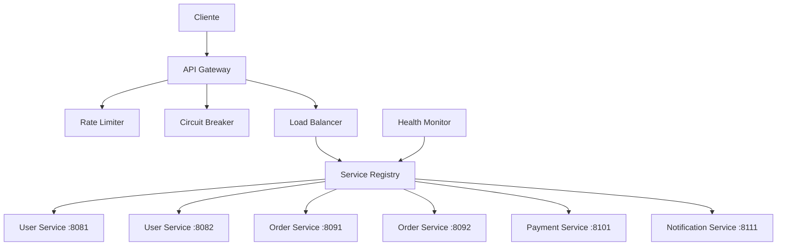
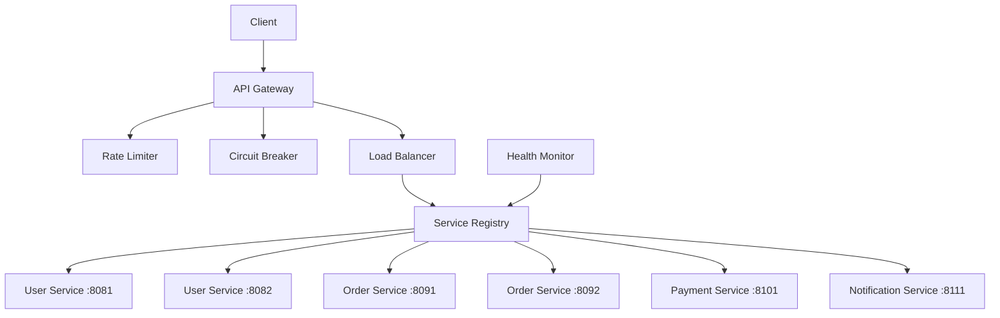

# Spring Boot Microservices

[English](#english) | [Portugues](#portugues)

---

## Portugues

Plataforma de microsservicos em Java implementando padroes enterprise: API Gateway com rate limiting, Service Registry, Circuit Breaker, Load Balancing (Round Robin) e monitoramento de saude dos servicos.

### Arquitetura



### Funcionalidades

- API Gateway com roteamento dinamico e rate limiting (Token Bucket)
- Service Registry para descoberta automatica de servicos
- Circuit Breaker com estados CLOSED, OPEN e HALF_OPEN
- Load Balancer Round Robin com verificacao de saude
- Health Monitor para monitoramento de instancias
- Suporte a multiplas instancias por servico

### Tecnologias

| Tecnologia | Finalidade |
|---|---|
| Java 11+ | Linguagem principal |
| Maven | Gerenciamento de dependencias |
| ConcurrentHashMap | Registro thread-safe |
| Design Patterns | Gateway, Circuit Breaker, Registry |

### Como Executar

```bash
mvn compile
mvn exec:java -Dexec.mainClass="com.galafis.microservices.MicroservicesPlatform"
```

---

## English

Java microservices platform implementing enterprise patterns: API Gateway with rate limiting, Service Registry, Circuit Breaker, Load Balancing (Round Robin), and service health monitoring.

### Architecture



### Features

- API Gateway with dynamic routing and rate limiting (Token Bucket)
- Service Registry for automatic service discovery
- Circuit Breaker with CLOSED, OPEN, and HALF_OPEN states
- Round Robin Load Balancer with health checking
- Health Monitor for instance monitoring
- Multi-instance support per service

### How to Run

```bash
mvn compile
mvn exec:java -Dexec.mainClass="com.galafis.microservices.MicroservicesPlatform"
```

## Author

Gabriel Demetrios Lafis

## License

MIT License
